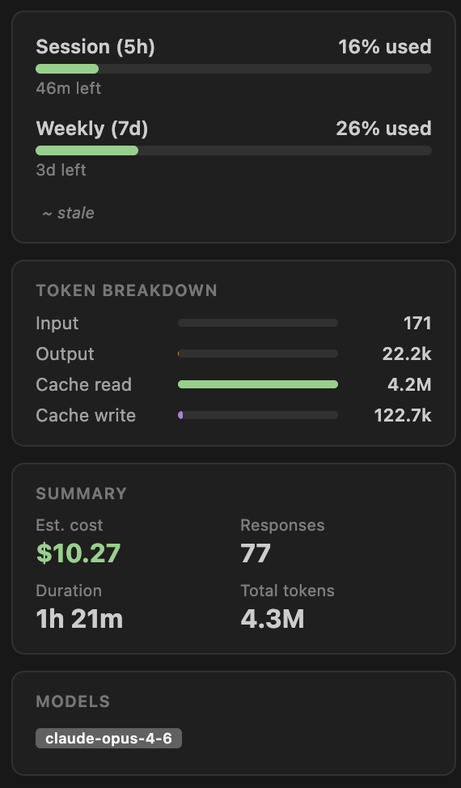
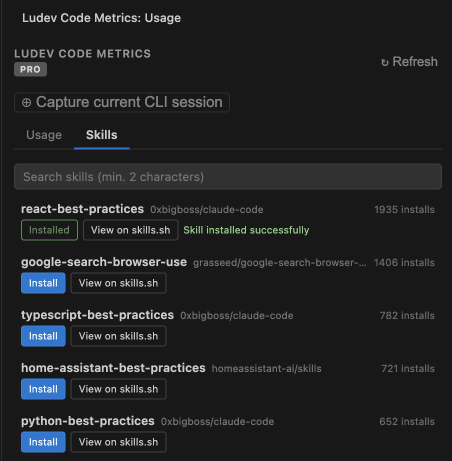

# Ludev Code Metrics

A VS Code extension that shows your [Claude Code](https://claude.ai/code) subscription usage — session (5h), weekly (7d), and real-time context metrics — directly in the Status Bar and in a dedicated sidebar panel.

- [Screenshots](#screenshots)
- [Features](#features)
- [Quick Start](#quick-start)
- [Status Bar](#status-bar)
- [Sidebar Panel](#sidebar-panel)
- [Context Monitor](#context-monitor)
- [Skills Browser](#skills-browser)
- [Configuration](#configuration)
- [Credential Resolution](#credential-resolution)
- [Internationalization](#internationalization)
- [Architecture](#architecture)
- [Testing](#testing)
- [Change Log](#change-log)
- [Contributing](#contributing)


## Screenshots

### Usage Overview


### Skills Management


### Status Bar


## Features

1. **Status Bar items** — three live items: session (5h), weekly (7d), and context monitor (cost + tokens), always visible.
2. **Dynamic colors** — green → warning (orange) → error (red) as usage rises.
3. **Sidebar panel** — Activity Bar icon opens a panel with usage bars (simple progress bars like the Anthropic web console), context metrics, and a skills browser.
4. **Overview card** — Session (5h), Weekly (7d), and Opus (7d) in compact bars; the Opus row is hidden automatically when no data is available.
5. **Context Monitor** — real-time session metrics from local Claude Code transcripts: token breakdown (input, output, cache read, cache write), estimated cost, response count, session duration, models used, and multi-session selector.
6. **Subscription plan badge** — displays your plan (Free, Pro, Max 5x, Max 20x, Team...) in the sidebar header, read from local credentials.
7. **Skills browser** — search and install Claude Code skills from [skills.sh](https://skills.sh) directly from the sidebar; installs into the current workspace's `.claude/skills/` directory.
8. **Persistent tab** — the sidebar remembers the last open tab between panel hide/show cycles.
9. **Multilingual UI** — automatically follows VS Code's display language (English, Spanish, Italian, French).
10. **Stale indicator** — shows `~` when the last fetch failed but cached data is available.
11. **Cross-platform credentials** — reads automatically from `~/.claude/.credentials.json` (written by Claude Code CLI). No manual token setup required in most cases.
12. **Auto-refresh** — optional periodic background refresh with configurable interval (1-60 minutes); disabled by default to avoid rate limits.
13. **Click to refresh** — clicking status bar items triggers an immediate update.
14. **Enter token manually** — Command Palette command and sidebar button to paste a raw OAuth token when automatic resolution fails.
15. **Set credentials path** — Command Palette command and sidebar button to point to a custom credentials JSON file; unlocks the plan badge in addition to usage data.
16. **Startup notification** — if no credentials are found at launch, a notification appears with an option to set credentials immediately or skip.
17. **Activity Bar badge** — the sidebar icon shows a `1` badge while no credentials are configured, disappearing once a valid token is found.
18. **Rate limit protection** — automatic retry with exponential backoff (1s -> 2s -> 4s, max 3 retries) for 429 and 5xx responses; respects `retry-after` header.
19. **Multi-account support** — accounts array in settings with automatic capture.
20. **Auth guidance** — clear hint to run `claude auth login` when not authenticated.
21. **Works without auth** — context metrics (local data) are always visible even without API credentials.

## Quick Start

1. Install the extension from the VS Code Extension menu or the Marketplace.
2. Make sure [Claude Code CLI](https://claude.ai/code) is installed and you are logged in — credentials are read automatically.
3. The three status bar items appear on the right side of the Status Bar immediately.
4. Click the clock icon in the Activity Bar to open the usage panel.

> If credentials are not found automatically, open the Command Palette (`Cmd/Ctrl + Shift + P`) and run **Claude Usage: Enter Token Manually**, or click the **Enter token manually** button in the sidebar panel.
>
> Context metrics work without API credentials — they read local Claude Code transcripts directly.

## Status Bar

Three items are shown on the right side of the Status Bar:

| Item | Priority | Format |
|------|----------|--------|
| Session (5h rolling) | Right, 100 | `$(clock) ▰▰▰▰▰▱▱▱▱▱ Session: 45% · 2h left` |
| Weekly (7d rolling)  | Right, 99  | `$(calendar) ▰▰▰▰▱▱▱▱▱▱ Weekly: 26% · 3d left` |
| Context              | Right, 98  | `$(zap) $39.52 · 19.7M tok` |

Dynamic icons change based on usage level:

| Threshold | Icon |
|-----------|------|
| < 80% | `$(pass)` |
| 80-94% | `$(warning)` |
| 95%+ | `$(error)` |

The visual bar uses 10 segments: `▰▰▰▰▱▱▱▱▱▱`

Colors change automatically:

| Threshold | Effect |
|-----------|--------|
| < `warningThreshold` (default 80%) | Text colored `charts.green` so the progress bar stands out |
| >= `warningThreshold` | `statusBarItem.warningBackground` (orange) |
| >= 95% | `statusBarItem.errorBackground` (red) |

Clicking any status bar item refreshes immediately.

## Sidebar Panel

Click the gauge icon in the Activity Bar to open the **Ludev Code Metrics** panel.

The panel shows:

- **Usage bars** — session and weekly progress bars, styled like the Anthropic web console.
- **Reset countdown** — "2h left", "3d left", etc.
- **Subscription plan badge** — your plan (Free, Pro, Max 5x...) shown in the header when credentials are loaded from the local store (Keychain or `~/.claude/.credentials.json`). Hidden in the no-auth state, and not shown when using a manual token (see note below).
- **Context metrics section** — token breakdown with colored bars, summary grid (cost, responses, duration, total tokens), model badges, and session selector for multiple sessions. See [Context Monitor](#context-monitor) below.
- **Stale badge** — appears if the last API call failed and cached data is shown.
- **Refresh button** — triggers an immediate API call (30-second cooldown to avoid rate limits).
- **Auto-refresh toggle** — located in the header. When enabled, hides the refresh button and shows a minutes input (default 5) and a rate-limit warning. Disabled by default.
- **Enter token manually button** — shown in the no-auth state; opens an input box to paste a raw token. Usage data loads but the plan badge will not appear.
- **Set credentials path button** — shown alongside the token button; opens a native file picker to select the Claude Code credentials JSON. Provides full credentials including the plan badge.
- **Auth guidance** — when not authenticated, a hint to run `claude auth login` is displayed.
- **Activity Bar badge (`1`)** — visible on the sidebar icon whenever no credentials are configured.
- **Overview card** — compact linear progress bars for Session (5h), Weekly (7d), and Opus (7d) all in one row. The Opus row is hidden if the API returns no Opus data.
- **Last updated** timestamp at the bottom.

## Context Monitor

The Context Monitor provides real-time metrics from local Claude Code transcripts, without requiring API credentials.

**Metrics tracked:**

- **Token breakdown** — input, output, cache read, and cache write tokens, displayed as colored bars.
- **Estimated cost** — calculated from configurable per-model token rates.
- **Response count** — total API responses in the session.
- **Session duration** — elapsed time since the session started.
- **Models used** — badges for each model seen in the transcript.
- **Multi-session selector** — when multiple Claude Code sessions are active, a dropdown lets you switch between them.

Token rates are configurable via the `ludevMetrics.costRates` setting (see [Configuration](#configuration)).

## Skills Browser

The **Skills** tab in the sidebar lets you discover and install [skills.sh](https://skills.sh) skills without leaving VS Code.

- **Auto-load** — the skill list loads automatically the first time you open the tab (top 50 results).
- **Search** — type two or more characters to filter skills by name.
- **Per-skill actions** — each result shows two buttons:
  - **Install** — downloads `SKILL.md` from GitHub and writes it to `.claude/skills/<skillId>/SKILL.md` in your current workspace, then updates `skills-lock.json`.
  - **View on skills.sh** — opens the skill's page in your browser.
- **Installed indicator** — once installed, the Install button turns green and is disabled.
- **Result cap** — when 50 results are returned a hint appears to refine the query.

> Skills are installed **per workspace**, not globally. Requires an open workspace folder.

## Configuration

Open Settings (`Cmd/Ctrl + ,`) and search for `ludevMetrics`.

| Setting | Type | Default | Description |
|---------|------|---------|-------------|
| `ludevMetrics.autoRefresh` | boolean | `false` | Enable automatic periodic refresh of usage data |
| `ludevMetrics.autoRefreshInterval` | number | `5` | Auto-refresh interval in minutes (1-60) |
| `ludevMetrics.warningThreshold` | number | `80` | Usage % at which the warning colour activates |
| `ludevMetrics.credentialsPath` | string | `""` | Path to a custom credentials JSON file (full credentials, includes plan type) |
| `ludevMetrics.manualToken` | string | `""` | Raw OAuth token fallback (usage data only, no plan badge) |
| `ludevMetrics.costRates` | object | see below | Per-million-token pricing rates (USD) for cost estimation |
| `ludevMetrics.costRates.inputPerMtok` | number | `3.00` | Cost per million input tokens |
| `ludevMetrics.costRates.outputPerMtok` | number | `15.00` | Cost per million output tokens |
| `ludevMetrics.costRates.cacheReadPerMtok` | number | `0.30` | Cost per million cache-read tokens |
| `ludevMetrics.costRates.cacheCreationPerMtok` | number | `3.75` | Cost per million cache-creation tokens |
| `ludevMetrics.accounts` | array | `[]` | Multi-account support with automatic capture |

All settings take effect immediately — no reload required.

## Credential Resolution

The extension tries the following sources in order and uses the first valid token found:

1. **macOS only:** system Keychain via `security find-generic-password -s "Claude Code-credentials"`.
2. `~/.claude/.credentials.json` — written automatically by Claude Code CLI (all platforms).
3. `~/.claude/credentials.json` — alternative path.
4. **Linux only:** `secret-tool lookup service "Claude Code-credentials"`.
5. **Windows only:** `%APPDATA%\claude\credentials.json`.
6. `ludevMetrics.credentialsPath` setting — or run **Claude Usage: Set Credentials File Path** from the Command Palette / sidebar button. Point to any valid `credentials.json` file; provides full credentials including the plan badge.
7. `ludevMetrics.manualToken` setting — or run **Claude Usage: Enter Token Manually** from the Command Palette / sidebar button. Raw token only.

> **Note — manual token limitations:** sources 1-5 provide the full credentials JSON, which includes the `subscriptionType` field used to display the plan badge (Pro, Max 5x, etc.). Source 7 is a raw token string only — the extension can fetch and display your usage data normally, but the plan badge will not appear because the subscription type is not available from the token alone and is not returned by the usage API.

The token is **never logged or written to disk** by this extension.

## Internationalization

The UI automatically follows the display language configured in VS Code. Supported languages:

| Locale | Language |
|--------|----------|
| `en` | English (default) |
| `es` | Spanish / Espanol |
| `it` | Italian / Italiano |
| `fr` | French / Francais |

**How it works:** strings in TypeScript files use `vscode.l10n.t()`. Webview strings are pre-translated on the extension host and injected as a JSON constant. Manifest strings (command names, setting descriptions) use `package.nls.*.json` files. Translation bundles live in `l10n/bundle.l10n.{locale}.json`.

To add a new language, create `l10n/bundle.l10n.{locale}.json` (following the existing files as templates) and `package.nls.{locale}.json` for the manifest strings.

## Architecture

Source files under `src/`:

| File | Responsibility |
|------|----------------|
| `extension.ts` | Entry point — wires up `UsageStatusBar` and `UsageSidebarProvider` |
| `statusBar.ts` | Three `StatusBarItem` instances, polling interval, stale cache, config listener |
| `sidebarView.ts` | `WebviewViewProvider` — assembles the HTML panel, routes webview messages |
| `usageApi.ts` | HTTPS fetch to `api.anthropic.com` with retry/backoff |
| `credentials.ts` | Cross-platform token resolution; also exports `getSubscriptionType()` |
| `skillsManager.ts` | skills.sh API search, skill installation (SKILL.md + skills-lock.json), cache |
| `usageHistory.ts` | Snapshot ring-buffer for historical usage data |
| `utils.ts` | Pure helpers: `formatTimeLeft`, `buildProgressBar`, `getColorByUsage`, etc. |
| `claudePaths.ts` | Cross-platform path resolution for Claude Code directories |
| `transcriptParser.ts` | Streaming JSONL parser for Claude Code transcripts |
| `sessionDetector.ts` | Detects active Claude Code sessions for the current workspace |
| `costCalculator.ts` | Per-model cost calculation from token usage |

Sidebar sub-modules under `src/sidebar/`:

| File | Responsibility |
|------|----------------|
| `sharedStyles.ts` | Base CSS (layout, tabs, buttons, animations) shared across all panels |
| `usageTab.ts` | Usage tab HTML, styles, and client-side script (includes context metrics) |
| `skillsTab.ts` | Skills tab HTML, styles, and client-side script |
| `types.ts` | `SidebarI18n`, `SessionInfo`, `TranscriptMetrics`, `CostBreakdown`, `CostRates` interfaces |

i18n files:

| File/Folder | Purpose |
|-------------|---------|
| `package.nls.json` | English manifest strings (command titles, setting descriptions) |
| `package.nls.{locale}.json` | Translated manifest strings |
| `l10n/bundle.l10n.{locale}.json` | Runtime translation bundles for `vscode.l10n.t()` |

## Testing

Unit tests are written with [Vitest](https://vitest.dev/) and run without a VS Code instance.
The `vscode` module is replaced by a lightweight mock so tests execute in plain Node.js.

```bash
pnpm test          # run all tests once
pnpm test:watch    # watch mode during development
```

75 tests across 8 test files:

| Test file | What is covered |
|-----------|-----------------|
| `src/test/utils.test.ts` | `formatTimeLeft`, `buildProgressBar`, `getDynamicIcon`, `getColorByUsage` |
| `src/test/usageApi.test.ts` | `fetchUsage` — 200/non-200 responses, bad JSON, network errors, timeout, headers, retry/backoff |
| `src/test/credentials.test.ts` | `getAccessToken` — file paths, JSON errors, Linux secret-tool, manual token fallback |
| `src/test/sidebarView.test.ts` | `UsageSidebarProvider` — HTML generation, message handling, i18n |
| `src/test/claudePaths.test.ts` | Cross-platform path detection |
| `src/test/costCalculator.test.ts` | Cost calculation logic |
| `src/test/sessionDetector.test.ts` | Session detection |
| `src/test/transcriptParser.test.ts` | Transcript parsing |

## Change Log

See [CHANGELOG.md](./CHANGELOG.md) for the full version history.

This project uses [Changesets](https://github.com/changesets/changesets) for versioning.

**In your feature branch:**

```bash
pnpm changeset        # choose bump type (patch/minor/major) and write a summary
git add .
git commit            # the .changeset/*.md file is committed alongside your code
```

**On merge to main:** a GitHub Action consumes the changesets, bumps `package.json`, and updates `CHANGELOG.md` via an automatic "Version Packages" PR.

## Repository Links

- **[Main Repository](https://github.com/ludevdot/ludev-code-metrics)** — source code and documentation
- **[Issues](https://github.com/ludevdot/ludev-code-metrics/issues)** — report bugs or request features
- **[Pull Requests](https://github.com/ludevdot/ludev-code-metrics/pulls)** — view and contribute changes

## Contributing

Contributions are welcome! Please feel free to submit a Pull Request.

1. Fork the repository
2. Create your feature branch (`git checkout -b feature/AmazingFeature`)
3. Commit your changes (`git commit -m 'Add some AmazingFeature'`)
4. Create a changeset before opening the PR:
   ```bash
   pnpm changeset
   ```
   This will prompt you to:
   - Select the bump type (`patch`, `minor`, or `major`)
   - Write a summary of your changes

   A new file will be created in `.changeset/` — commit this file alongside your code.
5. Push to the branch (`git push origin feature/AmazingFeature`)
6. Open a Pull Request

**Note:** Changesets are consumed automatically when merging to `main`, which bumps the version and updates `CHANGELOG.md`.
